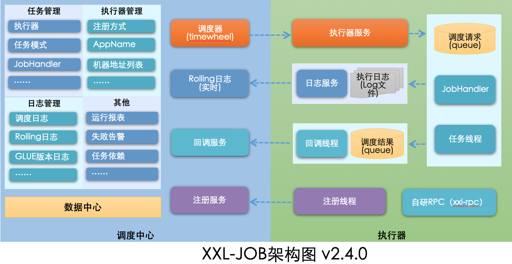
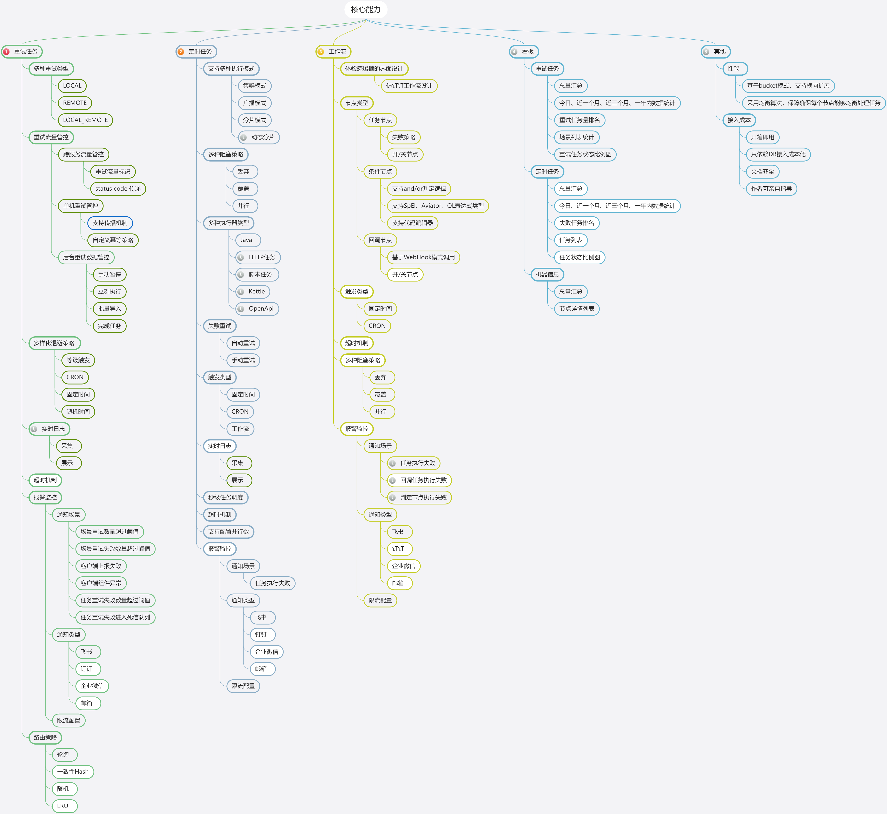

# 分布式任务调度培训，教案

## 使用场景

1. 报表。 电商，昨天的订单量， SAAS平台，日，周，月

2. 结单。日，周，月对账单

3. 爬虫 定时去爬内容

4. 数据归档，达到一定量级，归档成冷数据。 把3个月之前的数据归档到其他地方，访问次数对很低
   
## 事故教训

1. 拜年短信忘记关闭，结果给客户拜了个早年。
   需求:
   只运行一次，
   指定时间运行，如通过传参的方式指定2023年运行，年为必传参数

2. 下载三方资源
   需求:异常情况下，如整体业务积压，部分(重要)客户对及时性要求很高，要保证优先下载。
   按指定时间区间，指定客户id下载， 水平扩容分片下载。

# 任务调度框架类型

## 非分布式

### @Scheduled注解

> 为什么@Scheduled不是分布式任务调度？

* 代码demo讲解
  
> 使用方法: 不加 @Component， 不加 @EnableScheduling 

> 引申问题: System.out.println 局限, 所有日志使用log

> 场景演示，查看log.系统没完全启动成功就执行 `initialDelay`

> fixedRate 与 fixedDelay 区别

> 在线Cron表达式生成器使用: https://cron.qqe2.com/    e.g: 工作日早上8:20-8.25 每分钟提醒一次打卡

> spring 支持6个参数？？？ 不支持传入年的参数，拜年短信怎么办？？？ 在线Cron表达式7个参数？？？ linux cron 只有5个参数？？？ 官方说明在哪里

* Schedule串行阻塞演示
  
> Schedule 与 multi-Thread演示

> Schedule 与 Async演示

## 分布式

### 1.@QuartZ

> 文档: https://www.quartz-scheduler.org/  与 springboot的集成 https://docs.spring.io/spring-boot/reference/io/quartz.html

> 集成后demo演示

> 不足: 集成与使用麻烦，无内置管理终端(调度中心)。 

> QuartZ 貌似与 @Scheduled 没区别，那么他是分布式的嚒？？？

### 2.@Elasticjob

> 文档: https://shardingsphere.apache.org/elasticjob/index_zh.html

* Lite Cloud 两个版本
* 依赖中间件 ZooKeeper、Mesos


(图片来源于官方: https://shardingsphere.apache.org/elasticjob/index_zh.html)  

### 3.@XXL-JOB
  
  > 文档: https://www.xuxueli.com/xxl-job/

#### 架构图


(图片来源于官方: https://www.xuxueli.com/xxl-job/)

从架构图可以看出，分别有调度中心和执行器两大组成部分

* 调度中心。负责管理调度信息，按照调度配置发出调度请求，自身不承担业务代码。支持可视化界面，可以在调度中心对任务进行新增，更新，删除，会实时生效。支持监控调度结果，查看执行日志，查看调度任务统计报表，任务失败告警等等。
* 执行器。负责接收调度请求，执行调度任务的业务逻辑。执行器启动后需要注册到调度中心。接收调度中心的发出的执行请求，终止请求，日志请求等等。

#### 任务详解(配置属性详细说明)

* (拜年短信)触发配置： 调度类型：无：该类型不会主动触发调度???；

* 路由策略: 

- ROUND（轮询）：
- FAILOVER（故障转移）：按照顺序依次进行心跳检测，第一个心跳检测成功的机器选定为目标执行器并发起调度；
- SHARDING_BROADCAST(分片广播)：广播触发对应集群中所有机器执行一次任务，同时系统自动传递分片参数；可根据分片参数开发分片任务；

Q:轮询&故障转移演示， 使用场景分析
轮询轮询正常的机子，包含了故障转移， 那故障转移的使用场景是什么？

Q:分片广播 演示

阻塞处理策略：

出自廖师兄课程: https://coding.imooc.com/class/453.html

单机串行如何展示

> 有调度时间，没执行时间。 任务停止后，还在执行。
> 丢弃后续调度
> msg：block strategy effect：Discard Later
> 执行器3次失败，1次成功。 调度时间与执行时间有3秒间隔。

覆盖之前调度

> 抛出异常

调度时间(5秒)，任务执行时间(1秒)情况下，选用那种`调度过期策略`都可以。
RPC通讯，需要单独开放端口

#### 容器化中使用中的问题

0. docker版本号问题
1. docker下MySQL地址127.0.0.1问题。 办公IP地址问题 和 家庭IP地址问题不一样，解决方案。
2. 由1引申如何排障， docker 容器内无`ping``ifconfig`命令
3. 执行器运行在多网卡的场景下，如何配置执行器地址
4. 官方提供docker run命令中`accessToken`问题
5. 由4引申如何排障， `docker cp 9449f502580a:/app.jar ./`  `mv app.jar app.zip`  `unzip app.zip`

### 4.@SchedulerX

> 文档: https://www.aliyun.com/aliware/schedulerx

```text
SchedulerX 是阿里巴巴自研的分布式任务调度平台（兼容开源 XXL-JOB/ElasticJob/Spring Schedule/K8s Job），支持 Cron 定时、一次性任务、工作流任务编排、分布式跑批，具有高可用、可视化、低延时等能力。
```

### 5.@PowerJob
> 官网: http://www.powerjob.tech/

> github: https://github.com/PowerJob/PowerJob

> 中文文档: https://www.yuque.com/powerjob/guidence/intro

### 同类产品对比(取自github项目readme.md)

|         | QuartZ                         | xxl-job                          | SchedulerX 2.0                        | PowerJob                                        |
| ------- | ------------------------------ | -------------------------------- | ------------------------------------- | ----------------------------------------------- |
| 定时类型    | CRON                           | CRON                             | CRON、固定频率、固定延迟、OpenAPI                | **CRON、固定频率、固定延迟、OpenAPI**                      |
| 任务类型    | 内置Java                         | 内置Java、GLUE Java、Shell、Python等脚本 | 内置Java、外置Java（FatJar）、Shell、Python等脚本 | **内置Java、外置Java（容器）、Shell、Python等脚本**           |
| 分布式计算   | 无                              | 静态分片                             | MapReduce动态分片                         | **MapReduce动态分片**                               |
| 在线任务治理  | 不支持                            | 支持                               | 支持                                    | **支持**                                          |
| 日志白屏化   | 不支持                            | 支持                               | 不支持                                   | **支持**                                          |
| 调度方式及性能 | 基于数据库锁，有性能瓶颈                   | 基于数据库锁，有性能瓶颈                     | 不详                                    | **无锁化设计，性能强劲无上限**                               |
| 报警监控    | 无                              | 邮件                               | 短信                                    | **WebHook、邮件、钉钉与自定义扩展**                         |
| 系统依赖    | JDBC支持的关系型数据库（MySQL、Oracle...） | MySQL                            | 人民币                                   | **任意Spring Data Jpa支持的关系型数据库（MySQL、Oracle...）** |
| DAG工作流  | 不支持                            | 不支持                              | 支持                                    | **支持**                                          |

### 6.@SnailJob

> 前言： https://mp.weixin.qq.com/s/g7NuVJPoZUr8a2p2x6MzWg
> ** 集成 `snailjob` 移除 `powerjob`(投诉的人太多使用成本太高)(感谢 dhb52) ** 

> 中文文档: https://snailjob.opensnail.com/docs/introduce/preface.html

> slogan: SnailJob 是一个灵活、可靠且高效的分布式任务重试和任务调度平台。其核心采用分区模式实现，具备高度可伸缩性和容错性的分布式系统。拥有完善的权限管理、强大的告警监控功能和友好的界面交互。

> 核心能力 ** 作者亲自指导 ** 
> 

### 7.@Saturn

> 文档(唯品会): https://vipshop.github.io/Saturn/#/zh-cn/3.x/
> github: https://github.com/vipshop/Saturn

### 8. `xxl-job`使用过程一些注意点 
1. 测试`xxl-job`分片效果，可在evn 指定`-Dserver.port=xxxx`启动多个实例

2. 官方给出的`创建容器并运行xxl-job-admin的docker`命令，配置的MySQL需要配置，对应的`accessToken: 'default_token'`
```shell
docker run -e PARAMS="--spring.datasource.url=jdbc:mysql://127.0.0.1:3306/xxl_job?useUnicode=true&characterEncoding=UTF-8&autoReconnect=true&serverTimezone=Asia/Shanghai" -p 8080:8080 -v /tmp:/data/applogs --name xxl-job-admin  -d xuxueli/xxl-job-admin:{指定版本}
```
```shell
docker run  -e PARAMS="--spring.datasource.url=jdbc:mysql://{自定义域名}:3306/xxl_job?useUnicode=true&characterEncoding=UTF-8&autoReconnect=true&serverTimezone=Asia/Shanghai --spring.datasource.username=root --spring.datasource.password=root123456" -p 8080:8080 -v /tmp:/data/applogs --name xxl-job-admin  -d xuxueli/xxl-job-admin:2.4.1
```
3. (xxl-job支持其他告警方式) 任务失败告警

默认提供邮件失败告警，可扩展短信、钉钉等方式。如果需要新增一种告警方式，只需要新增一个实现 “com.xxl.job.admin.core.alarm.JobAlarm” 接口的告警实现即可。可以参考默认提供邮箱告警实现 “EmailJobAlarm”。

### 引用
1. 廖师兄课程: https://coding.imooc.com/class/453.html